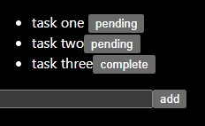

# A simple in memory to-do list 

This two stage web app is built with React using Next.JS/Typescript on the front end along with a backend asp.net core 6 API written in c#

## Running the project 

both the front end and back end need to run. To start the front end react app you can use Next.js command below 

`cd 'src/simple-to-do-list'`

`npx run dev` or `npm run dev`

You can run the backend API by using the .Net CLI. First build the solution and then run the dll

`cd 'src/simple-to-do-list-api/SimpleToDoListAPI/ToDoListApi'`
`dotnet build`
`dotnet run`

## Example 

